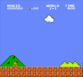
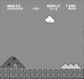
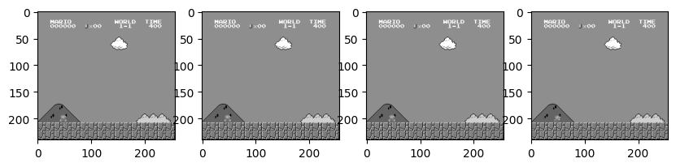
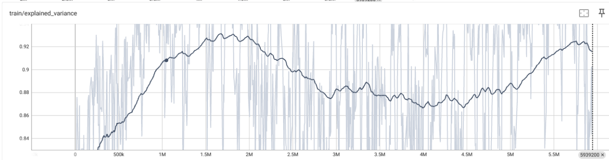
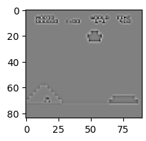
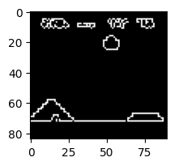
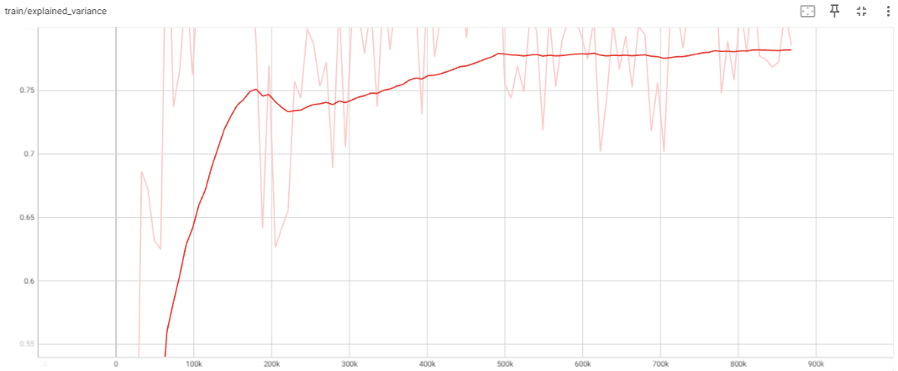
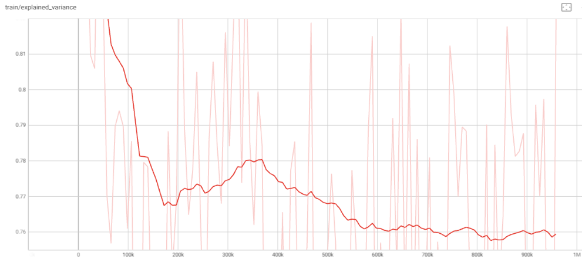
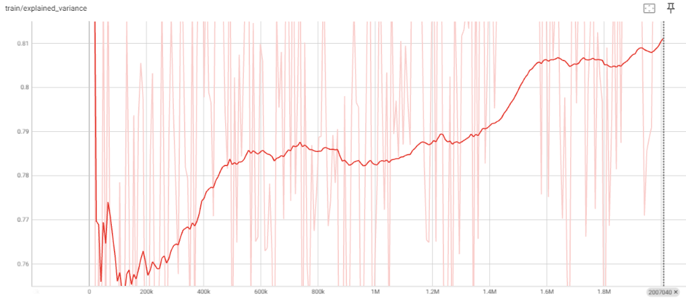

<!-- Consignes pour la constitution du rapport et le déroulement de la présentation
Le plan que vous devrez suivre pour votre présentation et le dossier est le suivant :

Explication et formalisation du problème
Description des données
Présentation du travail effectué (protocole expérimental, nettoyage des données, méthodes utilisées, paramétrage des algorithmes, etc)
Résultats obtenus
Discussion et ouverture
Bibliographie
Précisions :

Les supports de présentation sont à déposer en amont des soutenances. Chaque équipe disposera de 15 min de présentation suivi de 10 min de questions. Attention à la qualité du discours, des supports et à la répartition équitable du temps entre les membres de l'équipe.
Pour le dossier, visez une dizaine de pages. -->

<!-- A tester : pandoc pour passer de Markdown à pdf -->

# Rapport de projet - Reinforced Mario

## par Arthur Meyniel, Hugo Fouché et Aurelie Chamouleau

<!-- Date + Nom de l'école + logo ESEO -->

<!-- Table des matières -->

<!-- Outline finale -->

## Introduction

Le jeu Super Mario Bros, depuis sa sortie dans les années 1980, a captivé des millions de joueurs à travers le monde. Au-delà de son succès commercial, ce jeu iconique présente un intérêt particulier pour le domaine de l'intelligence artificielle, spécialement dans l'étude de l'apprentissage par renforcement.

Super Mario Bros offre un environnement complexe et dynamique, idéal pour tester et développer des algorithmes d'apprentissage par renforcement. Avec ses niveaux variés, ses obstacles imprévisibles et ses objectifs multiples, le jeu pose des défis qui imitent des problèmes réels dans le domaine de l'IA. La capacité d'un agent à apprendre et à s'adapter dans cet environnement peut fournir des insights précieux sur les applications de l'apprentissage par renforcement dans des situations complexes.

## Explication et Formalisation du Problème

## Description des données

Ce projet tire parti des données fournies par `gym-super-mario-bros`, une bibliothèque basée sur la technologie `Gymnasium` développée par OpenAI. L'environnement `SuperMarioBros-v0` est utilisé pour la récupération des données de jeu, qui se présentent sous deux formes principales :

1. Images du Jeu :

   - Chaque image de jeu est capturée avec une résolution de 240x256 pixels, en format couleur RGB.
   - Ces images sont stockées sous forme de tableaux NumPy tridimensionnels de taille 240x256x3. Chaque valeur au sein de ces tableaux représente une intensité de couleur, variant de 0 à 255.

2. Dictionnaire de l'État du Jeu :
   - Les données incluent un dictionnaire exhaustif qui renferme des informations détaillées sur l'état actuel du jeu. Ce dictionnaire comprend :
     - La position de Mario, le score, le temps restant, etc.
     - La récompense obtenue lors de l'étape précédente.
     - Un indicateur booléen signalant si le jeu est terminé.
     - Des informations complémentaires sur le niveau, telles que le nombre de pièces collectées et le temps restant.

### Reward function

La fonction de récompense, élément clé de cet environnement, est conçue autour de l'objectif principal du jeu : maximiser la progression horizontale (à droite) de l'agent, aussi rapidement que possible, tout en évitant la mort. Cette fonction se compose de trois variables distinctes :

1. v - Différence de Position Horizontale :

   - v = x1 - x0, où x0 et x1 représentent respectivement la position horizontale de Mario avant et après un pas de temps.
   - Une valeur positive (v > 0) indique un mouvement vers la droite, tandis qu'une valeur négative (v < 0) signale un mouvement vers la gauche.

2. c - Différence Temporelle :

   - c = c0 - c1, où c0 et c1 sont les lectures de l'horloge du jeu avant et après un pas de temps.
   - Cette variable sert de pénalité pour dissuader l'agent de rester immobile.

3. d - Pénalité de Mort :
   - Attribue une pénalité significative en cas de décès de l'agent, pour encourager l'évitement de la mort.
   - d = 0 en cas de survie et d = -15 en cas de décès.

La récompense totale, r, est alors calculée comme la somme de ces trois composantes : r = v + c + d. Elle est limitée à l'intervalle [-15, 15].

Cette reward function est pensée de manière à accentuer sur les points suivants :

- Optimisation de la progression horizontale : La variable v est conçue pour inciter l'agent à progresser vers la droite, en alignement direct avec l'objectif du jeu. Cette composante favorise une progression dynamique, en récompensant les déplacements vers la droite tout en pénalisant les mouvements opposés. Cette approche est cruciale pour l'orientation stratégique de l'agent dans l'espace de jeu.

- Minimisation de l'inertie temporelle : La composante c introduit un mécanisme de pénalisation pour l'inactivité, dissuadant ainsi l'agent de demeurer immobile. Cette dimension temporelle est fondamentale dans l'encouragement de prises de décision rapides et efficaces, contribuant à une dynamique de jeu plus active et engagée.

-Prévention de la mort : La pénalité d, attribuée en cas de décès de l'agent, est un élément dissuasif majeur contre les actions à haut risque. Cette composante sert à équilibrer le comportement de l'agent entre la recherche de progression et la nécessité de survie, ajoutant une couche de complexité stratégique au processus décisionnel.

- Équilibre et simplicité : La clarté et la simplicité de cette fonction de récompense sont des atouts non négligeables. En se concentrant sur des variables directement liées aux objectifs du jeu, elle facilite l'interprétation et l'adaptation de l'agent à son environnement. De plus, le plafonnement de la récompense totale à [-15, 15] prévient les déséquilibres dans l'apprentissage, assurant une distribution équilibrée des récompenses et des pénalités.

### Dictionnaire `info`

Le dictionnaire `info`, retourné par la méthode `step`, contient des clés informatives cruciales, telles que :

- `coins` : Le nombre de pièces collectées.
- `flag_get` : Booléen indiquant si Mario a atteint un drapeau ou une hache.
- `life` : Le nombre de vies restantes.
- `score` : Le score cumulatif du jeu.
- `stage` : L'étape actuelle du jeu.
- `status` : Le statut de Mario (petit, grand, avec des boules de feu).
- `time` : Le temps restant sur l'horloge du jeu.
- `world` : Le monde actuel du jeu.
- `x_pos` : La position horizontale de Mario dans l'étape.
- `y_pos` : La position verticale de Mario dans l'étape.

Les données sont mises à jour à chaque frame, offrant ainsi une vue dynamique et détaillée du déroulement du jeu en temps réel.

## Présentation du travail effectué

Le travail est réalisé en plusieurs parties :

- Une étude expérimentale pour comprendre les données récupérées en entrées
- Un choix d'algorithmes d'apprentissage par renforcement -> 2 algorithmes ont été choisis : PPO et DDQN
- Pour chaque algorithme, un nettoyage des données a été réalisé
- Pour chaque algorithme, les impacts des paramètres ont été étudiés
- Pour chaque algorithme, les résultats ont été analysés

### PPO

#### Principe

L'algorithme Proximal Policy Optimization (PPO) est une méthode avancée d'apprentissage par renforcement qui vise à améliorer la stabilité et l'efficacité de l'entraînement des agents dans des environnements complexes. Ce qui distingue PPO d'autres algorithmes, c'est sa capacité à équilibrer l'exploration efficace de l'espace d'action et la convergence stable vers une politique optimale. Voici une explication détaillée de son fonctionnement :

##### 1. **Politiques de Comportement et Cibles :**

- PPO opère avec deux politiques distinctes : la politique de comportement (celle actuellement suivie par l'agent) et la politique cible (la politique mise à jour que l'agent essaie d'apprendre).
- Ces politiques sont généralement représentées par des réseaux de neurones, qui déterminent les actions à prendre dans un état donné.

##### 2. **Avantage Estimation :**

- PPO utilise l'estimation de l'avantage pour déterminer à quel point une action est meilleure que la politique moyenne dans cet état.
- L'avantage est calculé en utilisant la récompense obtenue et les valeurs prédites de l'état, aidant à comprendre quelles actions améliorent la performance par rapport à une politique de base.

##### 3. **Ratio de Probabilités d'Action :**

- PPO calcule le ratio des probabilités d'une action sous la politique cible par rapport à la politique de comportement. Ce ratio est crucial pour ajuster la politique de l'agent.
- Si le ratio est très élevé ou très bas, cela signifie que la politique cible se comporte très différemment de la politique de comportement, indiquant un potentiel de déséquilibre.

##### 4. **Fonction Objectif Clipée :**

- Pour éviter des mises à jour trop importantes (qui peuvent entraîner une instabilité), PPO utilise une fonction objectif avec un mécanisme de "clipping".
- Ce mécanisme limite (ou "clippe") le ratio de probabilités d'action à un intervalle autour de 1 (par exemple, entre 0.8 et 1.2). Si le ratio sort de cet intervalle, la récompense est limitée, empêchant ainsi des changements trop radicaux dans la politique.

##### 5. **Mise à Jour de la Politique :**

- La politique de l'agent est mise à jour en optimisant la fonction objectif clipée. Cela implique généralement plusieurs itérations de mise à jour sur le même ensemble de données pour raffiner la politique.
- Ces mises à jour sont effectuées de manière à ce que la nouvelle politique ne s'écarte pas trop de l'ancienne, assurant ainsi une progression stable et évitant les fluctuations extrêmes.

##### 6. **Stabilité et Efficacité :**

- L'avantage principal de PPO réside dans sa capacité à maintenir un équilibre entre exploration efficace et exploitation, tout en évitant la volatilité souvent observée dans d'autres algorithmes d'optimisation de politiques.
- Grâce à son approche de mise à jour contrôlée, PPO parvient à améliorer la politique de l'agent de manière cohérente, favorisant ainsi un apprentissage stable et robuste.

En somme, PPO est un algorithme d'apprentissage par renforcement qui se distingue par son approche équilibrée et son mécanisme de mise à jour de politique innovant. Il est particulièrement adapté pour des environnements où la stabilité de l'apprentissage et la capacité d'adaptation de l'agent sont cruciales. Par son utilisation efficace de l'estimation d'avantage et son mécanisme de clipping unique, PPO offre un cadre robuste pour l'entraînement d'agents capables de prendre des décisions complexes et d'améliorer constamment leurs performances de manière stable.

#### Nettoyage des données et prétraitement

Comme expliqué dans la partie [Description des données](#description-des-données), les données récupérées sont des images de 240x256 pixels en RGB. Cela nous est fourni sous forme d'un tableau numpy de taille 240x256x3, avec des valeurs comprises entre 0 et 255.

Une image du jeu est donc de taille considérable, et il est difficile de faire de l'apprentissage avec une image de cette taille. Il est donc nécessaire de réduire la taille des données en entrée.

Pour cela, nous avons réfléchi à plusieurs solutions :

- Réduire la taille de l'image en la redimensionnant
- Transformer l'image en noir et blanc afin de réduire le nombre de canaux et donc avoir une image de taille 240x256x1. En effet, le jeu est en couleur, mais les couleurs n'ont pas d'importance pour l'apprentissage. De plus, cela permet de réduire la taille des données en entrée par 3.

Nous avons commencé par passer l'image en noir et blanc comme ceci fait la plus grande différence en terme de taille de données. Puis nous avons effectué un prétraitement sur les données en entrée afin de faciliter l'apprentissage. Voici la comparaison entre une image de base et une image en noir et blanc :

    <figure class="image">
         
        <figcaption>Image de base (gauche) et image en noir et blanc (droite)</figcaption>
    </figure>

De plus, afin d'aider notre modèle, plutôt que de lui envoyer une seule image en entrée, nous lui envoyons les 4 dernières images du jeu. Cela permet de donner du contexte à notre modèle, et de lui permettre de comprendre la vitesse et la direction du personnage et des ennemis du jeu.

Voici un exemple de ce que reçoit notre modèle en entrée (4 premières images du jeu) :

    <figure class="image">
        
        <figcaption>Frame stack</figcaption>
    </figure>

##### Sans filtre

Voici l'`explained_variance` de notre modèle à la fin de son entraînement lorsqu'il n'y avait pas de filtre de canny appliqué aux données d'entrées.

    <figure class="image">
        
        <figcaption>Résultat sans filtre de Canny</figcaption>
    </figure>

La courbe ci-dessus représente l'`explained_variance` durant l'apprentissage.
Cette valeur nous permet de savoir à quel point notre modèle prédit bien ses actions. Plus l'`explained_variance` se rapproche de 1, plus sa prédiction est bonne et apporte de bons résultats. A l'inverse, plus cette valeur se rapproche de 0 et des valeurs négatives, plus notre modèle aurait de tout aussi bons voire meilleures résultats en effectuant une action aléatoire.

Nous ne voyons pas ici le début de l'apprentissage où la montée était grande et rapide. Nous pouvons en revanche constater que nous arrivions à un plateau où malgré un entraînement de plus en plus long, les avancées de notre modèle n'étaient pas significatifs.

Avec une `explained_variance` à environ 0.92, Mario était globalement bon et allait loin dans le niveau mais son niveau n'était pas suffisant pour le réussir ou pour bien appliquer ce qu'il a appris aux autres niveaux.

##### Avec filtre

Au vu des résultats obtenus, nous avons cherché à améliorer le prétraitement des données en entrée pour améliorer les performances de notre modèle. L'approche retenue a été d'appliquer un filtre pour simplifier l'image en entrée. Nous avons testé 2 filtres différents : un filtre Laplacien et un filtre de Canny.

    <figure class="image">
         
        <figcaption>Filtre laplacien (gauche) et filtre de Canny (droite)</figcaption>
    </figure>

Après avoir analysé ces deux filtres, nous avons décidé de garder le filtre de Canny car il permet de mieux distinguer les éléments du jeu. En effet, le filtre de Canny permet de faire ressortir les contours des éléments du jeu, ce qui permet à notre modèle de mieux les distinguer.

Après avoir réalisé un training de plus de 10h (presque 4 000 000 d'itérations), ce training a été réalisé en 3 étapes a cause du temps de calcul nécessaire, nous avons obtenu les résultats suivants :

    <figure class="image">
          
        <figcaption>Résultats PPO avec filtre de Canny</figcaption>
    </figure>

Nous remarquons donc avec ces courbes, que l'`explained_variance` s'est vite améliorée au début, puis a atteint un plateau vers 500k où l'apprentissage est devenu un peu plus lent. La valeur finale étant de 0.81, la prédiction du modèle est bonne même si elle pourrait encore être améliorée.

Après tests, on remarque comme présenté pendant la présentation orale que le filtre de Canny permet d'améliorer les performances de notre modèle. En effet, on remarque que le modèle converge plus rapidement (apprentissage nettement plus rapide des tuyaux à environ 200 000 itérations) et que les performances obtenues à la fin sont meilleures. Avec ce modèle, il est commun que Mario arrive à la fin du niveau 1-1, et il semble avoir plus de facilité sur les autres niveaux que notre modèle sans filtre.

#### Programation

Dans le cadre de notre projet, nous avons mis en place un processus d'entraînement pour un agent utilisant l'algorithme Proximal Policy Optimization (PPO), spécifiquement adapté pour le jeu "Super Mario Bros". Nous décrivons ici en détail les étapes clés et les composants de notre mise en œuvre :

1. Configuration des Environnements de Jeu :
Nous commençons par configurer les environnements de jeu en utilisant gym.make. Nous adaptons chaque environnement au contexte spécifique de "Super Mario Bros". Ensuite, comme décrit dans la partie précédente, nous prétraitons les données d'entrée pour faciliter l'apprentissage. Ainsi, nous restreignons l'espace des actions à des mouvements simples grâce à `JoypadSpace` et `SIMPLE_MOVEMENT` et nous convertissons les observations (images du jeu) en nuances de gris, les redimensionnons et les normalisons pour faciliter le traitement par notre modèle.

2. Création d'Environnements Vectorisés :
Nous utilisons `DummyVecEnv` pour créer plusieurs instances de l'environnement de jeu fonctionnant en parallèle, ce qui augmente l'efficacité de l'entraînement.
Nous empilons un certain nombre d'images consécutives (ici, 4) pour donner à notre modèle une perception de la dynamique temporelle.

3. Configuration des Callbacks :
Dans notre projet, nous avons intégré deux types de procédures de rappel (Callbacks) pour superviser le processus d'entraînement et pour évaluer l'efficacité de notre modèle :

- Callback d'enregistrement : Nous avons mis en place `TrainAndLoggingCallback`, qui est programmé pour sauvegarder automatiquement l'état de notre modèle à des intervalles réguliers durant la phase d'entraînement. Cela nous permet de suivre les progrès et de conserver des points de restauration intermédiaires du modèle.
- Callback d'évaluation : Nous utilisons également `EvalCallback`, qui a pour fonction principale d'apprécier la performance de notre modèle dans un environnement distinct réservé à l'évaluation. Ce processus nous aide non seulement à mesurer l'efficacité du modèle, mais également à identifier et conserver la version la plus performante du modèle au cours du temps.

4. Chargement et Configuration du Modèle PPO :
Nous chargeons un modèle PPO préexistant et le configurons pour utiliser nos environnements d'entraînement.

5. Entraînement du Modèle :
Nous entraînons le modèle pour un nombre défini de pas de temps. Les callbacks assurent l'enregistrement du modèle et l'évaluation de ses performances à intervalles réguliers.

6. Enregistrement du Modèle Entraîné :
Après l'achèvement de l'entraînement, nous enregistrons le modèle final pour une utilisation ou une analyse ultérieure.

En résumé, nous avons développé un système d'entraînement sophistiqué pour un agent d'apprentissage par renforcement dans l'environnement de "Super Mario Bros", en exploitant les capacités de l'algorithme PPO. Nous avons mis l'accent sur l'efficacité de l'apprentissage grâce à la parallélisation, le prétraitement des données d'entrée, et une gestion robuste des étapes d'entraînement et d'évaluation. Cette approche assure non seulement un entraînement rapide et efficace, mais aussi une optimisation continue de la politique de l'agent, conduisant à un modèle performant et bien adapté au contexte complexe du jeu.

#### Résultats

Pour la méthode du  PPO sans le filtre de Canny, nous sommes allés jusqu'à 14 millions d'itérations, atteignant une `explained_variance` de 0.92 ; mais le modèle issus de l'entraînement n'a pas réussi à terminer le niveau 1-1 et sa généralisation aux autres niveaux était plutôt limitée.

Cependant, l'amélioration du PPO avec un filtre de Canny a permi au second modèle de terminer le premier niveau et d'avoir une assez bonne généralisation des autres niveaux.

### DDQN

#### Principe

1. Principes de base du DDQN :
Le DDQN est une variante de l'algorithme Deep Q-Network (DQN). Le DQN utilise un réseau neuronal pour estimer les valeurs Q, qui représentent la qualité d'une action donnée dans un certain état. Ces valeurs Q aident l'agent à prendre des décisions sur quelles actions effectuer. L'innovation clé du DDQN par rapport au DQN standard est la séparation de la sélection et de l'évaluation des actions. Cette séparation vise à réduire le biais de surévaluation inhérent au DQN.

2. Double réseaux :
Le DDQN utilise deux réseaux neuronaux : le réseau principal (pour la sélection des actions) et le réseau cible (pour l'évaluation des valeurs Q). Ces réseaux sont identiques en termes d'architecture mais leurs poids sont mis à jour différemment.

3. Sélection des actions :
À chaque pas de temps, l'agent sélectionne une action en utilisant le réseau principal. Cette sélection peut impliquer une stratégie d'exploration-exploitation, comme la méthode ε-greedy, où l'agent explore aléatoirement l'environnement avec une probabilité ε et exploite sa connaissance le reste du temps.

4. Mise à jour des réseaux :
Lors de la mise à jour, le DDQN utilise le réseau principal pour sélectionner l'action la plus prometteuse dans l'état suivant. Cependant, la valeur Q de cette action (pour le calcul de la cible de mise à jour) est estimée à l'aide du réseau cible. Cette approche réduit le risque de surévaluation des valeurs Q. Les poids du réseau principal sont régulièrement mis à jour par l'apprentissage, tandis que les poids du réseau cible sont périodiquement synchronisés avec ceux du réseau principal.

5. Mémoire de replay :
Le DDQN intègre une mémoire de replay, une technique où les expériences de l'agent (états, actions, récompenses, nouveaux états) sont stockées. L'agent réapprend alors à partir de ces expériences échantillonnées aléatoirement, ce qui aide à rompre les corrélations temporelles et à stabiliser l'apprentissage.

6. Processus de mise à jour :
La mise à jour des poids du réseau se fait en calculant la différence (l'erreur) entre la valeur Q prédite par le réseau principal pour une action donnée et la valeur Q cible. La valeur Q cible est calculée en utilisant la récompense obtenue pour l'action plus la valeur Q maximale pour l'état
suivant, évaluée par le réseau cible pour l'action sélectionnée par le réseau principal. Cette erreur est ensuite utilisée pour effectuer une mise à jour des poids par descente de gradient.

7. Synchronisation du réseau cible :
Les poids du réseau cible sont mis à jour moins fréquemment que ceux du réseau principal. Généralement, après un certain nombre de pas de temps ou d'épisodes, les poids du réseau principal sont copiés dans le réseau cible. Cette approche assure que les valeurs Q cibles sont stables sur des périodes plus longues, réduisant ainsi la volatilité de l'apprentissage.

8. Réduction du biais de surévaluation :
Le DDQN atténue le biais de surévaluation souvent observé dans le DQN standard. En utilisant deux réseaux pour séparer la sélection de l'action la plus prometteuse de l'évaluation de sa valeur, le DDQN évite de surestimer systématiquement les valeurs Q, menant à des estimations plus fiables et à une meilleure performance d'apprentissage.

Conclusion :
Le DDQN, en introduisant une séparation entre la sélection et l'évaluation des actions, fournit une méthode plus précise et stable pour l'estimation des valeurs Q dans des environnements complexes. Cette sophistication supplémentaire le rend particulièrement adapté pour des tâches comme la navigation dans "Super Mario Bros", où l'agent doit prendre des décisions basées sur des évaluations précises des résultats potentiels de ses actions.

#### Nettoyage des données

Comme expliqué pour le [PPO](#nettoyage-des-données-et-prétraitement)
, nous avons néttoyé les données pour envoyer en entrée les quatre images précédentes en noir et blanc. En revanche, nous n'avons pas appliqué de filtre de Canny pour cette méthode.

#### Programmation

Dans notre projet, nous avons développé et implémenté un agent utilisant l'algorithme Double Deep Q-Network (DDQN) pour jouer à "Super Mario Bros". Voici une description détaillée de notre code et de ses différentes composantes :

1. Initialisation de l'Agent :
Nous avons défini une classe `Agent` avec plusieurs hyperparamètres comme le taux d'apprentissage (`lr`), le facteur de dépréciation (`gamma`), les paramètres d'exploration (`epsilon`, `eps_decay`, `eps_min`), la taille de la mémoire de replay, la taille du lot d'apprentissage et la fréquence de synchronisation des réseaux.
L'agent possède deux réseaux neuronaux, le réseau principal (online_network) pour la sélection des actions et le réseau cible (target_network) pour l'évaluation des valeurs Q.
Nous avons également configuré un optimiseur et une fonction de perte (MSE ou SmoothL1Loss).

2. Structure du Réseau Neuronal :
Dans la classe `AgentNN`, nous avons conçu un réseau de neurones convolutionnels suivi de couches linéaires pour traiter les observations de l'environnement.
Cette architecture est utilisée pour les deux réseaux de l'agent, avec la possibilité de "geler" le réseau cible pour éviter sa mise à jour continue.

3. Choix des Actions et Apprentissage :
La méthode `choose_action` de l'agent utilise soit une action aléatoire (selon ε-greedy) soit la meilleure action prédite par le réseau principal. La méthode learn gère le processus d'apprentissage en échantillonnant des expériences de la mémoire de replay, en calculant la perte et en mettant à jour le réseau principal.

4. Mémoire de Replay et Synchronisation des Réseaux :
Nous avons implémenté une mémoire de replay (`TensorDictReplayBuffer`) pour stocker les expériences et les réutiliser pour l'apprentissage. La méthode sync_networks synchronise périodiquement le réseau cible avec le réseau principal, conformément à notre fréquence définie de synchronisation.

5. Environnement et Boucle d'Entraînement :
Nous avons configuré l'environnement "Super Mario Bros" avec des wrappers spécifiques et défini l'espace des actions. Une boucle d'entraînement exécute les épisodes, choisit les actions, stocke les expériences dans la mémoire de replay, et réalise l'apprentissage. Cette boucle gère également l'affichage du jeu et l'enregistrement des performances de l'agent.

6. Enregistrement et Chargement du Modèle :
Des méthodes pour sauvegarder et charger le modèle (`save_model` et `load_model`) permettent de conserver l'état de l'agent pour une utilisation ultérieure ou pour reprendre l'entraînement à partir d'un point spécifique.

7. Gestion de l'Exploration :
La méthode `decay_epsilon` permet de réduire progressivement le taux d'exploration (ε) de l'agent, favorisant une transition de l'exploration à l'exploitation au fur et à mesure que l'agent apprend.

8. Exécution Conditionnelle de l'Entraînement :
Nous avons inclus une condition pour activer ou désactiver l'entraînement (`SHOULD_TRAIN`), permettant ainsi à l'agent de soit apprendre de nouvelles expériences, soit de fonctionner en mode d'évaluation avec un modèle déjà entraîné.

Conclusion :
Notre implémentation du DDQN pour "Super Mario Bros" représente une approche sophistiquée et robuste pour l'entraînement d'agents dans des environnements de jeu complexes. En combinant des techniques avancées comme les réseaux neuronaux convolutionnels, la mémoire de replay, et l'exploration-exploitation équilibrée, nous avons conçu un système capable de naviguer efficacement dans le jeu tout en améliorant constamment ses performances à travers un apprentissage structuré et stable.

#### Résultats

L'entraînement avec le DDQN n'a pas été complété, étant donné que la valeur de `decay_epsilon` n'a atteint que 0.5 et aurait pu continuer à diminuer jusqu'à atteindre une valeur aux alentours de 0.2.
Bien que l'apprentissage n'ait pas été achevé, le modèle a fini le niveau 1-1 et généralisait plutôt bien les autres niveaux.

## Comparaison des résultats

### Entraînement

Notre première approche, basée sur le PPO, s'est révélée moins exigeante en termes de temps d'entraînement. Nous avons pu simultanément entraîner plusieurs agents, ce qui constituait un avantage par rapport DDQN. Ce dernier, en revanche, présentait une cadence d'entraînement plus lente, et la contrainte de ne pouvoir entraîner qu'un seul agent à la fois rendait le processus d'apprentissage plus lent.

Quant à l'application du filtre de Canny à la méthode PPO, cette inclusion n'a pas engendré de ralentissement notable de la phase d'entraînement par rapport à l'utilisation du PPO sans l'ajout du filtre.

### Résultats

En ce qui concerne les résultats, le modèle issu du PPO a montré des difficultés à compléter le niveau 1 et présentait une généralisation relativement faible aux autres niveaux. En revanche, les modèles issus de l'application du PPO avec le filtre de Canny et du DDQN ont terminé le niveau 1, et se sont avérés être plus efficaces dans la généralisation aux autres niveaux.

## Discussion et ouverture

### Difficultés rencontrées

Tout au long de notre projet, nous avons rencontré plusieurs difficultés.

Les premières étaient l'installation de l'environnement et des différents outils pour entamer notre projet, que ce soit l'installation des librairies pour l'environnement de gym-super-mario-bros, ou d'autres outils comme CUDA et pytorch pour utiliser notre carte graphique lors de l'apprentissage.

La principale autre difficulté était l'entraînement de nos modèles.
En effet, la puissance de calcul demandée par ce processus prenait beaucoup des ressources de nos ordinateurs (par exemple 27 Go de RAM sur 32) et les entraînements étaient longs.

En concéquence de ces entraînements longs, nous avons également eu du mal à réaliser les différentes méthodes et améliorations que nous avions en tête.

### Potentielles améliorations
1. Filtre de Canny avec le DDQN

Puisque nous avons constaté de meilleurs résultats lorsque nous avons appliqué un filtre de Canny aux données d'entrée du PPO, appliquer ce même filtre aux données d'entrée du DDQN pourrait donner un encore meilleur résultat que celui du DDQN seul.

2. Essayer le Frame skipping (saut d'images).

Cette méthode permettrait à notre agent de ne pas prendre d'action à chaque frame (image) mais par exemple une frame sur quatre. En sautant des images, on peut donc réduire le nombre d'observations traitées, ce qui permet d'accélérer l'entraînement tout en conservant une information suffisante pour prendre des décisions pertinentes (car l'information entre les images successives ne change pas de manière significative).

3. Temps d'entraînement plus long.

Nos méthodes auraient pu avoir de meilleurs résultats avec des temps d'entraînements encore plus, notamment pour la méthode du DDQN qui avait encore un grand taux d'exploration.

4. Entraînement sur différents niveaux de manière aléatoire.

Pendant nos différents entraînements, Mario s'est toujours entraîné sur le premier niveau du premier monde, et bien que dans certains cas il réussissait à finir le niveau, il avait plus de mal à aller loin dans les autres niveaux.
Une alternative serait donc qu'il soit entraîné sur un niveau aléatoire à chaque itération, pour que sa méthode soit adapté à n'importe quel environnement de jeu.

## Bibliographie

- [OpenAI Gymnasium](https://gymnasium.farama.org/)
- [OpenAI Gym Super Mario Bros](https://github.com/Kautenja/gym-super-mario-bros/tree/master)
- [Stable Baselines](https://stable-baselines.readthedocs.io/en/master/)
- [Pytorch](https://pytorch.org/)
- [PPO](https://openai.com/blog/openai-baselines-ppo/)
- [DDQN](https://towardsdatascience.com/double-deep-q-networks-905dd8325412)
- [DDQN](https://towardsdatascience.com/dueling-deep-q-networks-81ffab672751)
- [DDQN Mario Implementation](https://github.com/Sourish07/Super-Mario-Bros-RL/tree/main)
- [PPO Mario Implementation](https://github.com/nicknochnack/MarioRL)

